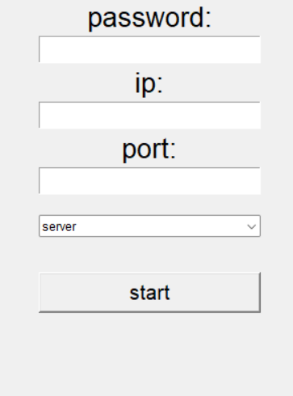

# هش HWVL
هش HWLV مخفف جمله Hash with variable length هست
که به فارسی به معنی هش با طول متغیر هست

قبل از اینکه به سراغ توضیح این الگوریتم بروم بیایید ویژگی های یک هش را برسی کنیم

# ویژگی های اصلی الگوریتم هش

- طول خروجی تابع هش یا مقدار هش، همیشه ثابت است.
- تا زمانی که ورودی تغییر نکند، مقداری خروجی تابع Hash قطعی و ثابت است.
- مقدار هش معمولاً بسیار کوچک‌تر از ورودی است. به همین خاطر به تابع هش، فشرده‌ساز نیز می‌گویند.
- عملکرد تابع هش با رمزنگاری متفاوت است.
- توابع Hash به‌صورت یک‌طرفه طراحی شده‌اند.

# نواوری در امنیت
 هش ما یک نواوری که در دنیای امنیت ایجاد کرده است که برخلاف الگوریتم های دیگر دو وردی می گیرد که به ترتیب :

- متنی که می خواهیم هش کنیم 
- طول خروجی 

افزایش طول خروجی سرعت را کم می کند ولی امنیت را بیشتر می کند و هر چقدر این عدد بزرگ تر باشد احتمال شکست در هش کمتر است

# اجرای الگوریتم

برای اجرای الگوریتم فایل HWVL.py را اجرا کنید
می توانید متن را وارد کنید و هش ان را دریافت کنید

همچنین با این الگوریتم یک پروژه ساختم که فکر کنم برای ما برنامه نویس ها خیلی کاربردی باشد
برای اجرا فایل test.py را اجرا کنید

این برنامه برای اشتراک یک متن در شبکه با پایتون است که برنامه نویس هایی که روی یک پروژه و در یک شبکه کار می کنند می توانند کد ها را با هم به اشتراک بگذارند

امنیت این شبکه با هش من تعمین می شود

برای تمامی ویندوز های خروجی گرفتم و در پوشه OUTPUT قرار دادم

امیدوارم که موفق باشید😊